# dio-poo-desafio-func-iphone
Desafio de Projeto - Avaliação do conteúdo técnico.
Explorando POO - Simulando funções do iPhone.

## Lista de classes, atributos e métodos

O diagrama abaixo ilustra como estruturaramos as classes.

| Classe    | Função   | Elemento | Tipo | Descrição |
|-----------|----------|--------------------|-----------|---------------------|
| PhoneControle | Controle | -modelo | Atributo (String) | O nome do aparelho (ex: "iPhone 15"). |
| PhoneControle | Controle | -estadoAparelho | Atributo (int) | O estado interno o aparelho: 0-inativo (default) ou 1-ativo. |
| PhoneControle | Controle | +ligarAparelho() | Método | Altera o estado do aparelho para ativo. |
| PhoneControle | Controle | +desligarAparelho() | Método | Altera o estado do aparelho para inativo. |
| PhoneControle | Controle | +autenticarUsuario() | Método | Solicitar validação de permissão de acesso do usuário ao telefone. |
| PhoneControle | Controle | -showEstadoAparelho() | Método | Apresentar ao usuário o estado de todos os controles do aparelho (bateria, conexão, rede de telefonia, etc.). |
| PhoneControle | Controle | +solicitarAcaoUsuario() | Método | Disponibiliza opções para usuário tomar ação do que quer fazer. |
| PhoneControle | Controle | +aumentarVolume() | Método | Aumentar o volume de saida de som do aparelho. |
| PhoneControle | Controle | +diminuirVolume() | Método | diminuir o volume de saida de som do aparelho. |
| - | - | - | - | - |
| Bateria | Controle | -nivelBateria | Atributo (int) | O estado interno da carga (0 a 100). |
| Bateria | Energia | +carregarBateria() | Método | Controlar o carregamento de energia da bateria. |
| Bateria | Energia | +consultarNivelBateria() | Método | Verificar o nível de energia da bateria. |
| - | - | - | - | - |
| Seguranca | Controle | -acessoAutorizado | Atributo (int) | O estado interno o aparelho: 0-Não autorizado (default) ou 1-Acesso autorizado. |
| Seguranca | Acesso | +solicitarCredencial() | Método | Solicitar ao usuário as credenciais de acesso. |
| Seguranca | Acesso | -validarBiometria() | Método | Altera o estado do aparelho para inativo. |
| Seguranca | Acesso | -validarFacial() | Método | Altera o estado do aparelho para inativo. |
| Seguranca | Acesso | -validarSenha() | Método | Altera o estado do aparelho para inativo. |
| Seguranca | Acesso | -validarGeometria() | Método | Altera o estado do aparelho para inativo. |
| - | - | - | - | - |
| Conexao | Controle | -modoAviao | Atributo (int) | O estado da conexão: 0-Modo Normal (default) ou 1-Modo Avião. |
| Conexao | Controle | -modoWifi | Atributo (int) | O estado do Wifi: 0-Modo Desligado (default) ou 1-Modo Ligado. |
| Conexao | Controle | -chipTelefonia | Atributo (int) | O estado do Chip de telefonia: 0-Chip Ausente (default) ou 1-Chip Presente. |
| Conexao | Controle | -redeTelefonia | Atributo (int) | Controla o estado da rede de telefonia: 0-sem sinal (default) ou 1-rede operante. |
| Conexao | Controle | +MODO_AVIAO_LIGADO | Constante (int) | (1) Constante indicativa de Modo Avião ligado. |
| Conexao | Controle | +MODO_AVIAO_DESLIGADO | Constante (int) | (0) Constante indicativa de Modo Avião desligado. |
| Conexao | Controle | +MODO_Wifi_LIGADO | Constante (int) | (1) Constante indicativa de Wifi ligado. |
| Conexao | Controle | +MODO_Wifi_DESLIGADO | Constante (int) | (0) Constante indicativa de Wifi desligado. |
| Conexao | Controle | +conectarRedeTelefonia() | Método | Conectar com a rede telefônica |
| Conexao | Controle | +desconectarRedeTelefonia() | Método | Desconectar da rede telefônica. |
| Conexao | Controle | +consultarEstadoChipTelefonia() | Método | Consulta o estado do Chip de telefonia. |
| Conexao | Controle | +consultarEstadoRedeTelefonia() | Método | Consulta o estado da rede de telefonia. |
| Conexao | Controle | +colocarModoAviao() | Método | Coloca o aparelho em modo avião, desligando todas as conecões, mas mantem o estado atual delas para retorno. |
| Conexao | Controle | +retirarModoAviao() | Método | Retira o aparelho do modo avião, retornando as conexões no estado em que estavam. |
| Conexao | Controle | +ligarModoWifi() | Método | Ligar as conexões do modo Wifi. |
| Conexao | Controle | +desligarModoWifi() | Método | Desligar as conexões do modo Wifi. |
| Conexao | Controle | +selecionarConexaoWifi() | Método | Verificar a rede e selecionar a conexão Wifi a ser conectada. |
| Conexao | Controle | +consultarModoAviao() | Método | Consulta o estado do modo Avião. |
| Conexao | Controle | +consultarEstadoWifi() | Método | Consulta o estado da conexão Wifi. |
| - | - | - | - | - |
| Agenda | Controle | -listaContato | Atributo (List) | Musica selecionada. |
| Agenda | Contato | +adicionarContato() | Método | Seleciona o número destino na agenda. |
| Agenda | Contato | +removerContato() | Método | Seleciona o número destino na agenda. |
| Agenda | Contato | +consultarContato() | Método | Seleciona o número destino na agenda. |
| Agenda | Contato | +consultarListaContato() | Método | Seleciona o número destino na agenda. |
| Agenda | Contato | +selecionarContatoDestino() -> numeroTelefDestino | Método | Seleciona o número destino na agenda. |
| - | - | - | - | - |
| AparelhoTelefonico | Chamada | -verificarSinalChamada() | Método | Verifica o estado da rede de telefonia ao realizar chamada. |
| AparelhoTelefonico | Chamada | +atenderChamada() | Método | Executa uma ação de atendimento de chamada telafônica. |
| AparelhoTelefonico | Chamada | +fazerChamada(numeroTelefDestino) | Método | Executa uma ação baseada em um parâmetro. |
| AparelhoTelefonico | Chamada | +desligarChamada() | Método | Finaliza a ação de chamada telafônica ativa. |
| - | - | - | - | - |
| MReprodutorMusical | Controle | -musicaSelecionada | Atributo (String) |Musica selecionada. |
| MReprodutorMusical | Media | +escolherNusica() | Método | Selecionar uma música para tocar e retorna o id da musica |
| MReprodutorMusical | Media | +tocarMusica() | Método | Interage com a interface de mídia executando a musica selecionada. |
| MReprodutorMusical | Media | +pausarMusica() | Método | Interage com a interface de mídia executando a musica selecionada. |
| MReprodutorMusical | Media | +pararMusica() | Método | Interage com a interface de mídia executando a musica selecionada. |
| - | - | - | - | - |
| NavegadorInternet | Controle | -urlSite | Atributo (String) | Site informado pelo usuário. |
| NavegadorInternet | Controle | -abaAtiva | Atributo (int) | Controle da aba ativa. |
| NavegadorInternet | Controle | -abaLista | Atributo (List) | Controle da aba ativa. |
| NavegadorInternet | Digitação | +solicitarSiteUsuario() -> String url | Método | Solicitar para o usuário informar o site da internet |
| NavegadorInternet | Conexão | -verificarConexaoInternet() | Método | Acessar o site informado pelo usuário. |
| NavegadorInternet | Navegação | +adicionarNovaAba() | Método | Adicionar nova aba no navegador. |
| NavegadorInternet | Navegação | +fecharAba() | Método | Fechar uma aba. |
| NavegadorInternet | Navegação | +selecionarAba() | Método | Seleciona uma aba da lista. |
| NavegadorInternet | Navegação | +mostrarAbas() | Método | mostra as abas existentes na lista. |
| NavegadorInternet | Navegação | +exibirPagina(String url) | Método | Acessar a url informada pelo usuário na aba ativa. |
| NavegadorInternet | Navegação | +atualizarPagina() | Método | Acessar a url informada pelo usuário na aba ativa. |
| NavegadorInternet | Navegação | +encerrarNavegacao() | Método | Encerrar navegação e fechar o navegador. |
| - | - | - | - | - |
| ICameraIntegrada | Controle | -listaImagem | Atributo (List) | Galeria de Imagens. |
| ICameraIntegrada | Controle | -estadoCamera | Atributo (int) | Estado da câmera: 0-Desligada ou 1-Ligada. |
| ICameraIntegrada | Controle | -modoCamera | Atributo (int)   | Modo da câmera: 0-Foto (default) ou 1-Video. |
| ICameraIntegrada | Imagem   | +iniciarCamera() | Método | Ligar a câmera e colocar em modo de uso. |
| ICameraIntegrada | Imagem   | +fecharCamera() | Método | Desligar a câmera do modo de uso. |
| ICameraIntegrada | Imagem   | +selecionarModoFoto() | Método | Seleciona o modo para tirar foto. |
| ICameraIntegrada | Imagem   | +selecionarModoVideo() | Método | Seleciona o modo para gravar video. |
| ICameraIntegrada | Imagem   | +tirarFoto() | Método | Registra a foto e coloca na galeria. |
| ICameraIntegrada | Imagem   | +gravarVideo() | Método | Grava o vídeo e coloca na galeria. |
| ICameraIntegrada | Imagem   | -inserirNaGaleria() | Método | Seleciona o número destino na agenda. |
| ICameraIntegrada | Imagem   | -deletarDaGaleria() | Método | Seleciona o número destino na agenda. |
| ICameraIntegrada | Imagem   | +listarGaleria() -> numeroTelefDestino | Método | Seleciona o número destino na agenda. |
| ICameraIntegrada | Imagem   | +mostrarFoto() -> numeroTelefDestino | Método | Seleciona o número destino na agenda. |
| ICameraIntegrada | Imagem   | +exibirVideo() -> numeroTelefDestino | Método | Seleciona o número destino na agenda. |

### O uso dos sinais "+" para público e "-" para privado

## Diagrama de Classe UML

```mermaid

classDiagram

    class IPhoneControle {
        -String modelo
        -int estadoAparelho 
        -Bateria bateria
        -showEstadoAparelho()
        +ligarAparelho()
        +desligarAparelho()
        +aumentarVolume()
        +diminuirVolume()
    }

    class IPhone {
        +IPhone(String modelo)
        +autenticarUsuario()
        +solicitarAcaoUsuario()
    }

    class Bateria {
        -nivelBateria | Atributo (int) | O estado interno da carga (0 a 100). |
        +carregarBateria() | Método | Controlar o carregamento de energia da bateria. |
        +getNivelBateria() | Método | Verificar o nível de energia da bateria. |
    }

    class Seguranca {
        -int acessoAutorizado | Atributo () | O estado interno o aparelho: 0-Não autorizado (default) ou 1-Acesso autorizado. |
        +solicitarCredencial()
        -validarBiometria()
        -validarFacial()
        -validarSenha()
        -validarGeometria()
    }

    class IConexao {
        -int modoAviao
        -int modoWifi
        -int chipTelefonia
        -int redeTelefonia
        -String redeWifiSelecionada
        +int MODO_AVIAO_LIGADO
        +int MODO_AVIAO_DESLIGADO
        +int MODO_Wifi_LIGADO
        +int MODO_Wifi_DESLIGADO
        +conectarRedeTelefonia()
        +desconectarRedeTelefonia()
        +int consultarEstadoChipTelefonia()
        +int consultarEstadoRedeTelefonia()
        +colocarModoAviao()
        +retirarModoAviao()
        +ligarModoWifi()
        +desligarModoWifi()
        +String selecionarConexaoWifi()
        +int consultarModoAviao()
        +int consultarEstadoWifi()
    }

    class Contato {
        -String nomeContato
        -String tipoTelefone
        -String paisTelefone
        -String dddTelefone
        -String numTelefone
    }

    class Agenda {
        -List<Contato> listaContato
        +adicionarContato(Contato)
        +removerContato(Contato)
        +Contato consultarContato()
        +List<Contato> consultarListaContato()
        +Contato selecionarContatoDestino()
    }

    class IAparelhoTelefonico {
        -Agenda agenda
        -verificarSinalRede()
        +atenderChamada() | Método | Executa uma ação de atendimento de chamada telafônica. |
        +fazerChamada(numeroTelefDestino) | Método | Executa uma ação baseada em um parâmetro. |
        +desligarChamada() | Método | Finaliza a ação de chamada telafônica ativa. |
    }

    class IReprodutorMusical {
        -musicaSelecionada | Atributo (String) |Musica selecionada. |
        +escolherNusica() | Método | Selecionar uma música para tocar e retorna o id da musica |
        +tocarMusica() | Método | Interage com a interface de mídia executando a musica selecionada. |
        +pausarMusica() | Método | Interage com a interface de mídia executando a musica selecionada. |
        +pararMusica() | Método | Interage com a interface de mídia executando a musica selecionada. |
    }

    class INavegadorInternet {
        -urlSite | Atributo (String) | Site informado pelo usuário. |
        -abaAtiva | Atributo (int) | Controle da aba ativa. |
        -abaLista | Atributo (List) | Controle da aba ativa. |
        +solicitarSiteUsuario() -> String url | Método | Solicitar para o usuário informar o site da internet |
        -verificarConexaoInternet() | Método | Acessar o site informado pelo usuário. |
        +adicionarNovaAba() | Método | Adicionar nova aba no navegador. |
        +fecharAba() | Método | Fechar uma aba. |
        +selecionarAba() | Método | Seleciona uma aba da lista. |
        +mostrarAbas() | Método | mostra as abas existentes na lista. |
        +exibirPagina(String url) | Método | Acessar a url informada pelo usuário na aba ativa. |
        +atualizarPagina() | Método | Acessar a url informada pelo usuário na aba ativa. |
        +encerrarNavegacao() | Método | Encerrar navegação e fechar o navegador. |
    }

    class ICameraIntegrada {
        -listaImagem | Atributo (List) | Galeria de Imagens. |
        -estadoCamera | Atributo (int) | Estado da câmera: 0-Desligada ou 1-Ligada. |
        -modoCamera | Atributo (int)   | Modo da câmera: 0-Foto (default) ou 1-Video. |
        +iniciarCamera() | Método | Ligar a câmera e colocar em modo de uso. |
        +fecharCamera() | Método | Desligar a câmera do modo de uso. |
        +selecionarModoFoto() | Método | Seleciona o modo para tirar foto. |
        +selecionarModoVideo() | Método | Seleciona o modo para gravar video. |
        +tirarFoto() | Método | Registra a foto e coloca na galeria. |
        +gravarVideo() | Método | Grava o vídeo e coloca na galeria. |
        -inserirNaGaleria() | Método | Seleciona o número destino na agenda. |
        -deletarDaGaleria() | Método | Seleciona o número destino na agenda. |
        +listarGaleria() -> numeroTelefDestino | Método | Seleciona o número destino na agenda. |
        +mostrarFoto() -> numeroTelefDestino | Método | Seleciona o número destino na agenda. |
        +exibirVideo() -> numeroTelefDestino | Método | Seleciona o número destino na agenda. |
    }

    %% Relacionamentos
    IPhoneControle --> IPhone : herda de
    IPhone --|> IReprodutorMusical : implementa
    IPhone --|> IAparelhoTelefonico : implementa
    IPhone --|> INavegadorInternet : implementa
    IPhone --|> ICameraIntegrada : implementa
    IPhone --|> ISeguranca
    IPhoneControle --> Bateria: estende 
    IAparelhoTelefonico --> Agenda : usa
    Agenda --> Contato : usa
    IReprodutorMusical --> Conexao : usa
    INavegadorInternet --> Conexao : extende

```

